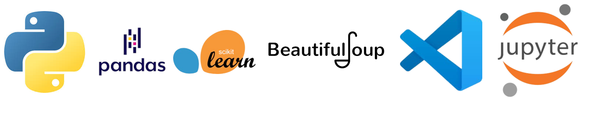

# NewsRecommend_Team_5
- 팀원: 가재준, 김윤일, 허홍

## Project
- 본 프로젝트에서는 네이버의 IT뉴스와 다음의 경제뉴스에서 관련 뉴스를 추천하는 시스템을 구축하였습니다. 네이버 뉴스의 IT 카테고리, 다음 뉴스의 경제 카테고리 뉴스를 크롤링하여 각 뉴스의 본문 내용을 토대로 벡터화를 진행한 후, 특정 뉴스 기사와의 코사인 유사도를 계산하여 유사도가 높은 뉴스를 컨텐츠 기반으로 추천하는 방식입니다. 

1. WHO?
    - 경제 및 IT 뉴스 구독자
2. WHAT? 
    - 현재 읽고 있는 뉴스(경제/IT) 기사와 관련된 경제 및 IT 뉴스를 모두 추천
3. WHY?
    - IT 산업이 4차 산업혁명 시대의 경제를 주도하는 시대 흐름에 맞게  IT와 경제에 대해 동시에 관심을 갖는 사용자 증가

## ENV

